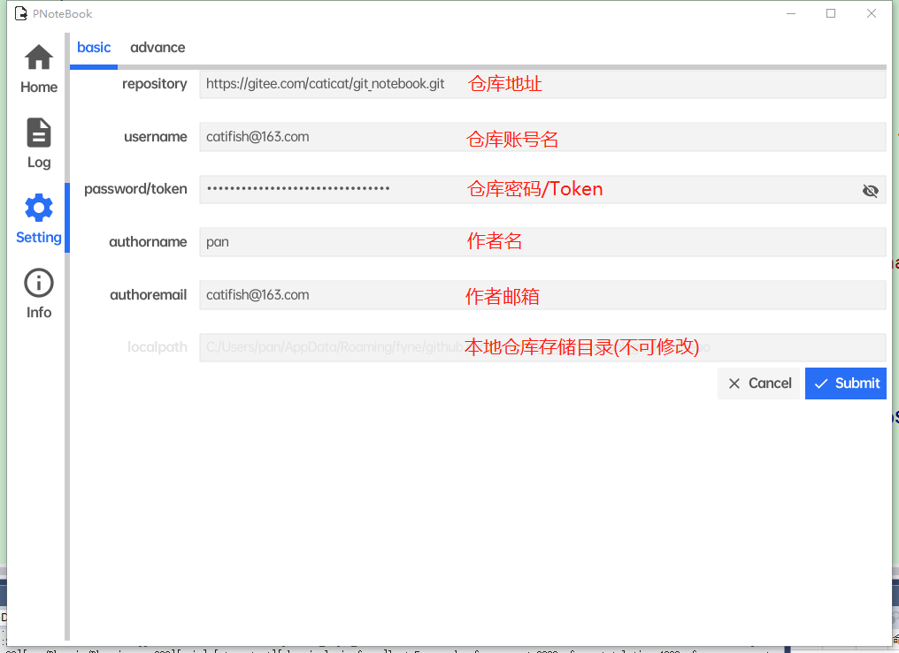

# go_git_notebook_gui

- a git based notebook gui implement by go with fyne
- 使用golang制作的跨平台云笔记界面
	- 当前只能存储文字
	- 图片只能使用连接
- 支持网站
	- [GitHub](https://github.com/)
	- [Gitee](https://gitee.com/)
- 设置说明

## 待制作

## 已实现

- 新建
	- 文件
	- 文件夹
- 删除
	- 文件
	- 文件夹
- 移动
	- 文件
	- 文件夹
- 导入
- 导出
- 预览界面
	- markdown支持
- 搜索
- 全部删除并推送
- 强制推送
- 强制拉取
- 启动时无法连接git时跳转到配置页签
- 首次打开编辑窗口处理
- 图片显示支持
- git日志

## 建议

- 过多的图片可能会导致仓库过大
	- 图片太多的情况下建议放在图床

## 已知问题

- markdown预览格式不完善
	- 列表排序可能有问题
	- 是gui库

## 更新内容

### v0.0.8

- 搜索框替换相对路径
- 说明文档完善

### v0.0.7

- 日志绝对路径调整为相对路径
- 本地存储路径显示在基础设置界面

### v0.0.6

- 支持markdown预览直接显示图片

### v0.0.5

- 切换仓库问题处理
	- 切换不成功
	- 界面不刷新

### v0.0.4

- `git log`增加

### v0.0.3

- 图片显示支持
- 文件移动失败问题修正

### v0.0.2

- 手机目录树展开死循环问题修正

## 打包

- `fyne package -os windows -appID github.com.caticat.go_git_notebook_gui -icon assets/myapp.png`
- `fyne package -os android -appID github.com.caticat.go_git_notebook_gui -icon assets/myapp.png`
